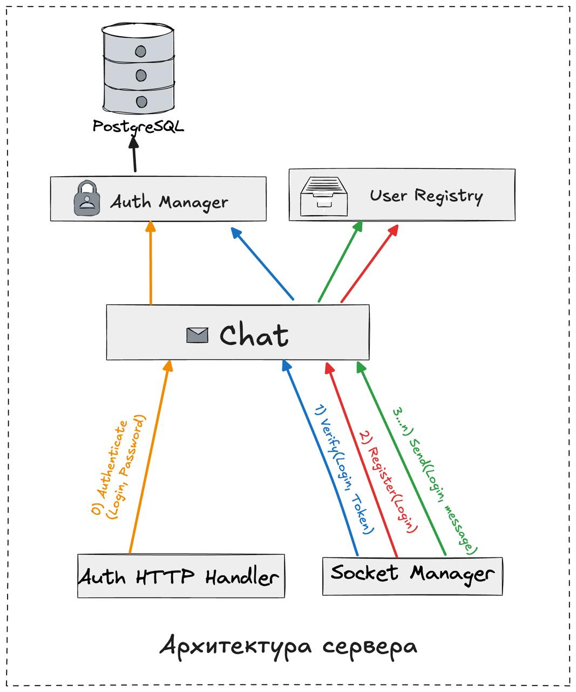
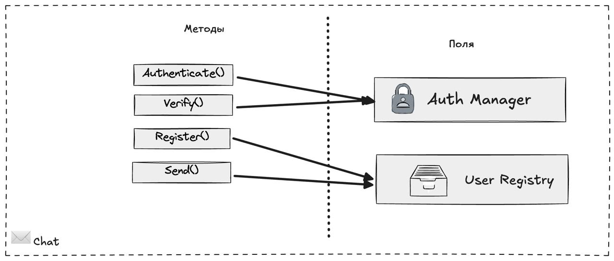
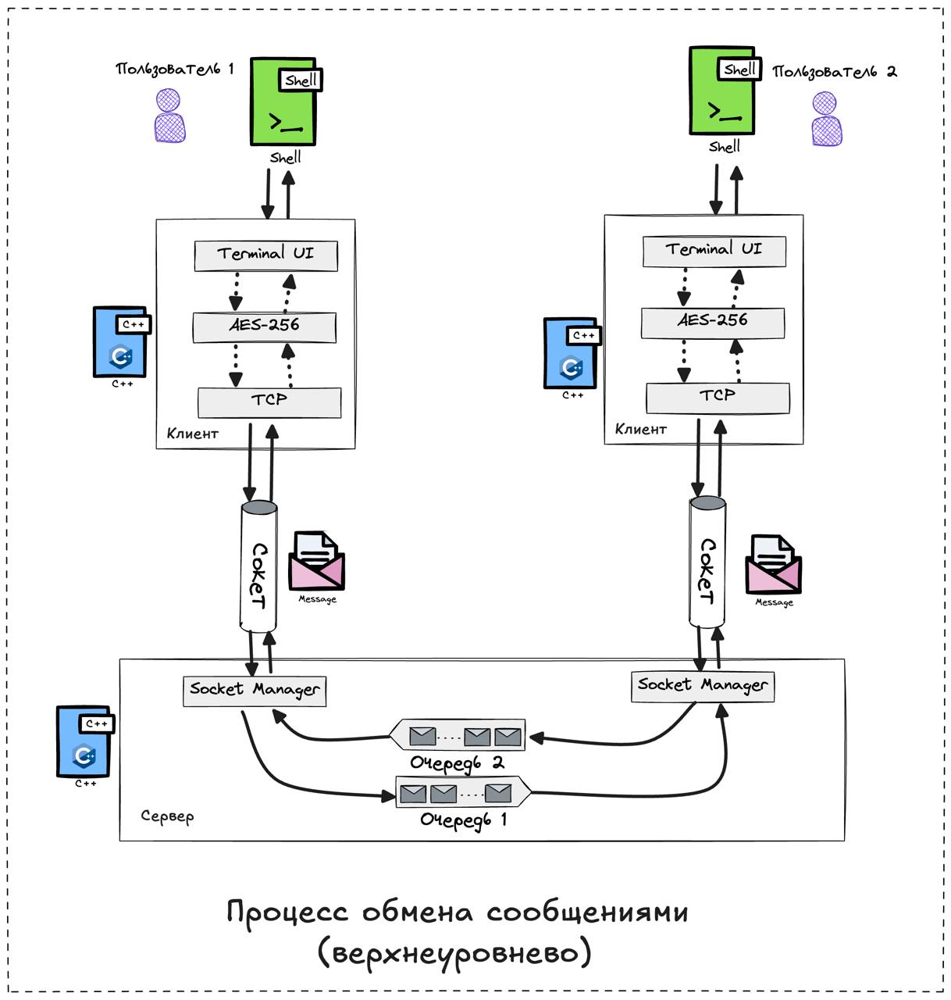
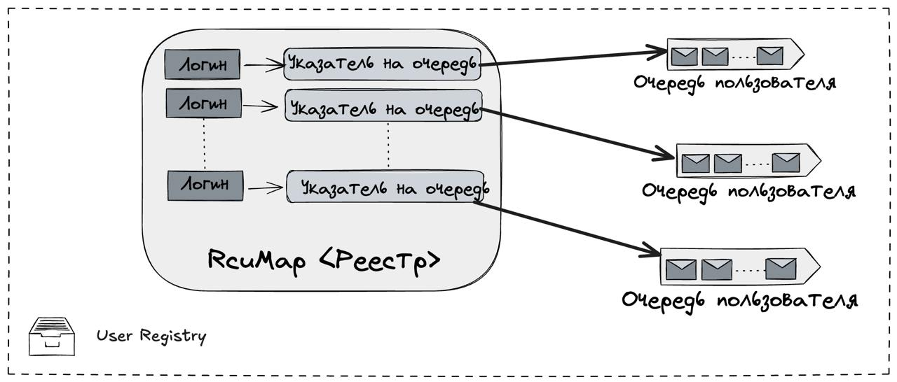
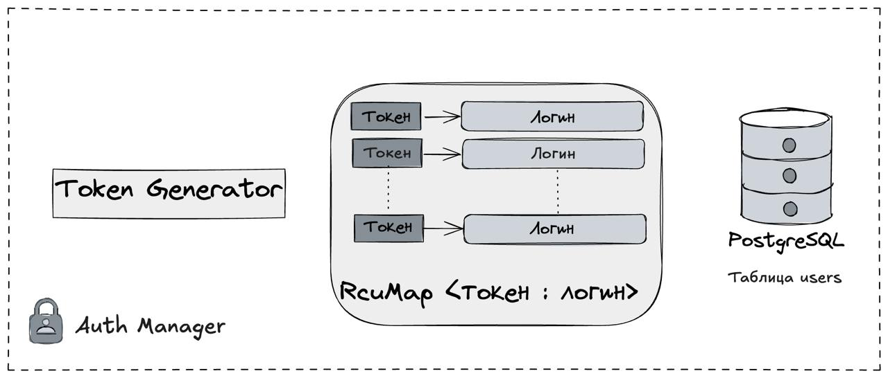

# Chat server
Сервер многопользовательского TCP-чата на фреймворке [userver](userver.tech)

- Каждый пользователь может одновременно поддерживать личную коммуникацию с несколькими собеседниками.
- Для подтверждения личности собеседников реализована аутентификация пользователей по логину/паролю
- Инструкции по запуску располагаются в [файле](run-instructions.md)

### Особенности реализации
- userver позволяет обрабатывать сообщения асинхронно и параллельно. У каждого пользователя при подключении появляется своя lock-free очередь, в которую собеседники будут отправлять сообщения . Так как чат многопользовательский выбрана NonFifoMpscQueue — сообщения от одного адресата приходят хронологически упорядоченно, от нескольких — не гарантируется.
- Один указатель на очередь передается в обработчик сокета, второй сохраняется в реестре онлайн-пользователей (RcuMap). Это позволяет при разрыве TCP-соединения и переподключении доставить сообщения, отправленные клиенту за время его отсутствия
- Аутентификация проходит по логин/паролю через HTTP. В случае успеха клиенту выдается токен, через который в дальнейшем его TCP-соединение будет идентифицировано
- Пароли пользователей хранятся в PostrgreSQL в захешированном виде с солью, чтобы в случае утечки нельзя было подобрать его по «радужным таблицам»

### Архитектура
- Chat — фасад, скрывающий для ручек внутреннее устройство системы
- UserRegistry — реестр онлайн пользователей, хранящий в `RcuMap` указатели на очереди сообщений
- AuthManager — отвечает за аутентификацию по паролю и выпуск токенов

[//]: # (### Алгоритм работы)

[//]: # ()
[//]: # (### Протокол  )